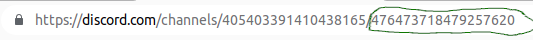

# README
Exports Discord chat logs to a csv-file, then using that csv file for making name replacements.

This project is based on [DiscordChatExporter](https://github.com/Tyrrrz/DiscordChatExporter).

Therefore it also requires a **.NET Runtime** which has to be installed manually. 
  - [.NET v6.0 Runtime for **Windows x64**](https://dotnet.microsoft.com/download/dotnet-core/thank-you/runtime-desktop-6.0.0-windows-x64-installer)

## Installing the python requirements
`pip install -r requirements.txt`

## Getting required information
You need to get your `Discord Token` and a `Channel ID` to use this tool.
Rename `config.template.yaml` to `config.yaml` and insert the Discord Token and Channel ID.
This file is also responsible for the replacements pairs. 

### How to get the Discord Token
1. Open Discord
2. Press Ctrl+Shift+I (⌥⌘I on macOS) to open developer tools
3. Press Ctrl+Shift+M (⇧⌘M) to toggle device toolbar
4. Navigate to the Application tab
5. On the left, expand Local Storage and select https꞉//discord.com
6. Type token into the Filter box
7. If the token key does not appear, press Ctrl+R (⌘R) to reload
8. Copy the value of the token key
[Source](https://github.com/Tyrrrz/DiscordChatExporter/wiki/Obtaining-Token-and-Channel-IDs#how-to-get-a-user-token)

or this video
- https://www.youtube.com/watch?v=YEgFvgg7ZPI

### How to get the channel id
Receive the channel token in the browser version of discord.

## Run the App
`python app.py`
- this will look in the `config.yaml` for the `channelID` to download the messages via the DiscordChatExporter
## Run the App with a CSV-FILE
`python app.py --csv "C:\my.csv"`
- this will look at the specified path for the CSV file and replaces the names based on the config.yaml.
